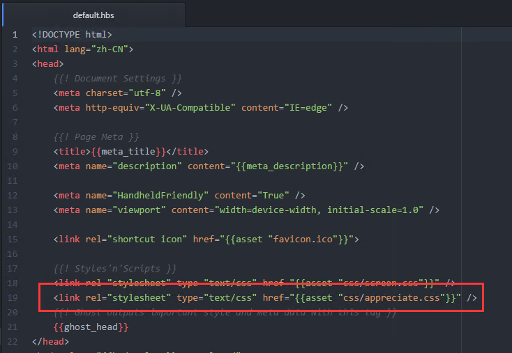
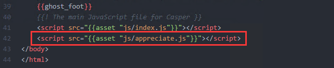
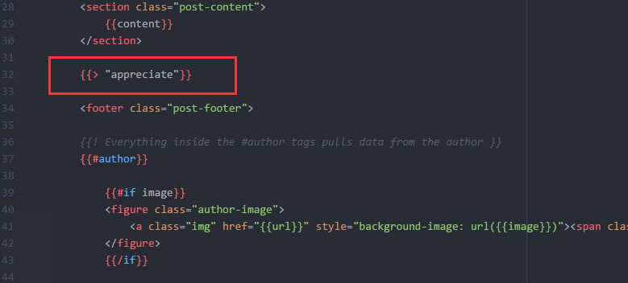

# Appreciate 模块


首先感谢[@罗磊](http://luolei.org)，这个时从他那里偷过来的，但是我搞不懂他是怎么写的，就把自己需要的部分拿过来然后修修补补什么的。

## 使用方法
1. src目录内容复制到主题文件夹
- 修改default.hbs引入css和js文件。


- 修改post.hbs文件，建议在`<footer class="post-footer">`上方插入`{{> "appreciate"}}`

- 修改自己的二维码
 - 方法1
 > 直接替换`assets/img`目录中的二维码
 - 方法2
 > 1. 新建博文草稿，`ctrl`+`shift`+`i`，在预览框中上传图片，得到`图片地址`。
 > - 打开后台的插入代码页面，``页头``处插入以下代码就搞定了
 ```JavaScript
 <script>
 var appreciate = {
	qcode:{alipay:"支付宝的二维码地址",wepay:"微信支付的二维码地址"}
}
</script>
```
